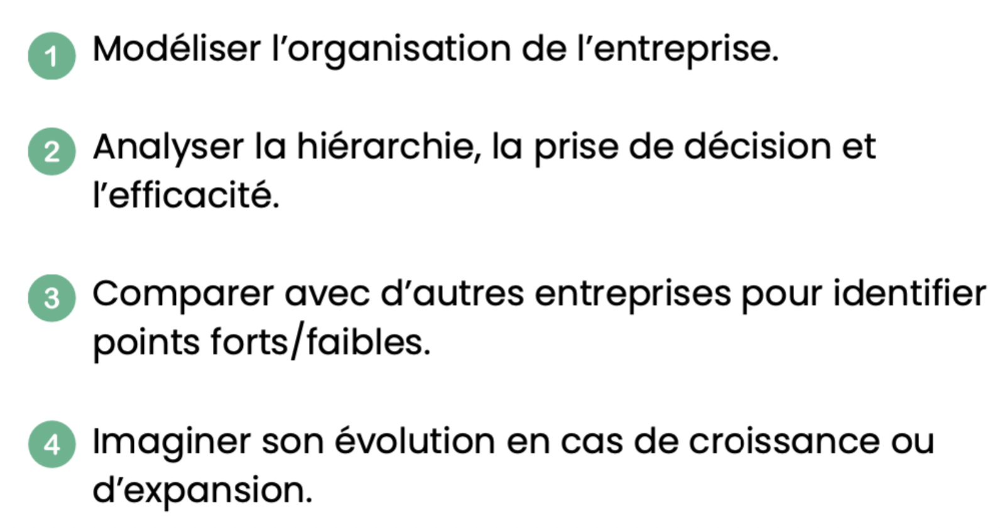

## T-ORG-600
**Analyse de l'organisation d'une entreprise afin d'identifier son fonctionnement, ses forces, ses faiblesses et proposer des améliorations structurelles.**  
  
### Quelle entreprise choisie
Gaspard: Epitech  
Ryan: Epitech  
Gino: Epitech  
  

### Les 4 objectifs principaux:

  
  
### Follow Up 1 - 04.03.2025

**IMPORTANT en premier :**  
Chercher les definitions:  
Comment as ton défini ce qu’on va analyser:  
Entreprise / structure / organisation  

Théorie des organisations
-> presenter une théorie / un axe à propos du type de structure

Individuel:
1. Organigramme(s) entreprise / service
2. Emettre une hypothèse(s) :
-> « Je pense que mon entreprise à ce type d’organisation / à tel structure » ex: hiérarchique / matriciel 

Comment recueillir les données:
- interviews, entretiens
- **questionnaires**
- scrapping

Quest ce que vous cherchez ? Quelles sont les données dont vous allez avoir besoin ?
Pensez toujours à la théorie, vos hypothèses, aux limites et votre méthodologie !

En groupe:
méthodologie -> comment chacun va s'organiser pour récolter des données. Exemple: formulaire pour répondre à l'hypothèse.
outil(s) -> script++ ou excel si complexe avec script
limite de excel pour faire de l'analyse de données statistiques
Comparer les données pas les résultats.

Tout sur GIT.

### Formulaire
🟢 Done
#### Process d'envoie / réponse
🔴 Pas envoyé  
🟠 envoyé, en attente de réponse  
🟡 m'a répondu sur teams pour m'informer qu'il/elle va répondre  
🟢 la personne m'a qu'elle a répondu (+ une augmentation du nombre de réponse dans le GDocs)  
🟣 m'a laissé en vu  
🔵 personne relancé  
⚪️ pas au bureau  
répondu au questionnaire : 11/19  
| Personnne | avancement | 
| :--------- |:------ |
| Antoine | 🟣🔵 |
| Guillaume | 🟣🔵 |
| Emmanuel | 🟣🟣 |
| Danny | 🟣🔵 |
| Thomas | 🟣🟣 |
| Romain | 🟣🟣 |
| Corinne | 🟢 |
| Ambre-iliana | 🟢 |
| Sarah | 🟢 |
| Clara | 🟢 |
| Patrick | 🟡🟢 |
| Camy | 🟣🟢 |
| Mélinda | 🟣🟢 |
| Magali | 🟣🟢 |
| Alexis | 🟣🟢 |
| Lucile | 🟣🟢 |
| Karine | 🟣🟢 |
| Matthieu | 🟠⚪️ |
| Sixtine | 🟠⚪️ |

### Gestion Avancement du Projet
| Avancement | Tâches |
| :--------- |:------ |
| 🟠 In progress | Les données recueillies permettent de visualiser l'organisation de l'entreprise |
| 🔴 To do | La source des données est citée ET fiable (provenant des RH ou de la direction de l'entreprise). |
| 🔴 To do | Les étudiants ont été proactifs dans la recherche des données |
| 🟢 Done | Les élèves produisent un organigramme de la direction de leur entreprise. |
| 🟢 Done | Les élèves produisent un organigramme des départements de leur entreprise (au moins les plus proches) et de leurs interactions. |
| 🔴 To do | Les élèves produisent un organigramme de leur équipe et des liens entre chaque membre. |
| 🔴 To do | Une documentation expliquant le fonctionnement des différentes procédures de l'entreprise (onboarding, réunions, workflow, etc.) |
| 🔴 To do | Les étudiants sont confrontés à plusieurs critères, tels que le rôle, la hiérarchie, le travail d'équipe, ... |
| 🔴 To do | Les étudiants sont confrontés à plusieurs critères, tels que le type d'organisation, la centralisation, les processus de validation, ... |
| 🔴 To do | Les élèves identifient au moins deux dysfonctionnements (redondances, goulets d'étranglement, non-respect des procédures, etc.) |
| 🔴 To do | Les élèves proposent au moins deux solutions pour les dysfonctionnements repérés. |
| 🔴 To do | Les étudiants connaissent leur rôle au sein de l'entreprise et sont capables d'identifier la manière dont ils peuvent faire avancer leurs idées. |
| 🔴 To do | Les élèves partagent leurs analyses et tirent des conclusions communes, en soulignant les forces et les faiblesses de chaque organisation. |
| 🔴 To do | Un document expliquant pourquoi l'entreprise des étudiants pourrait se développer |
| 🔴 To do | Un modèle d'organisation (ou un diagramme) montrant comment l'entreprise des élèves pourrait se développer. |
| 🔴 To do | Un processus de prise de décision adapté à la nouvelle organisation est mis en place. |
| 🟢 Done | Le projet est présenté de manière professionnelle à l'aide d'un support pertinent (diapositives et/ou démo) |
| 🟠 In progress | Les étudiants ont obtenu tous les résultats précédents |